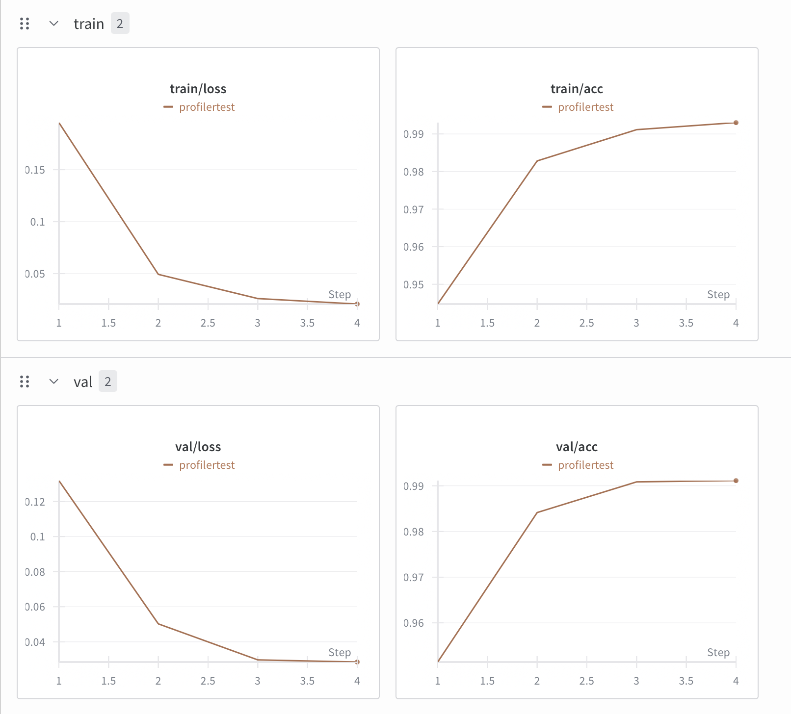
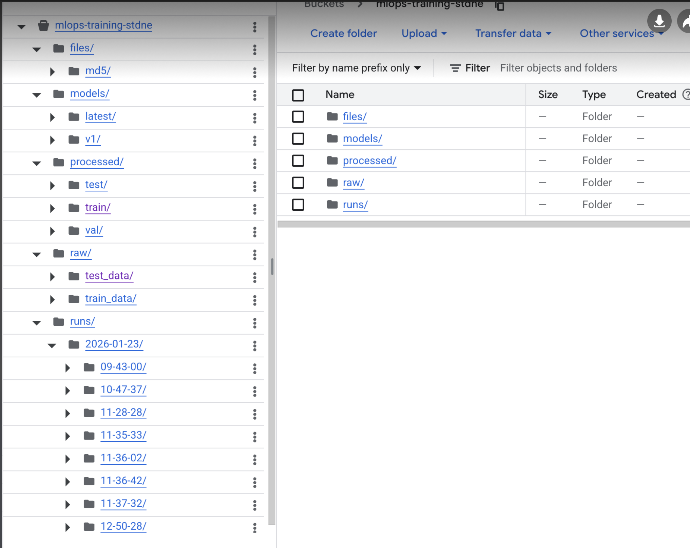
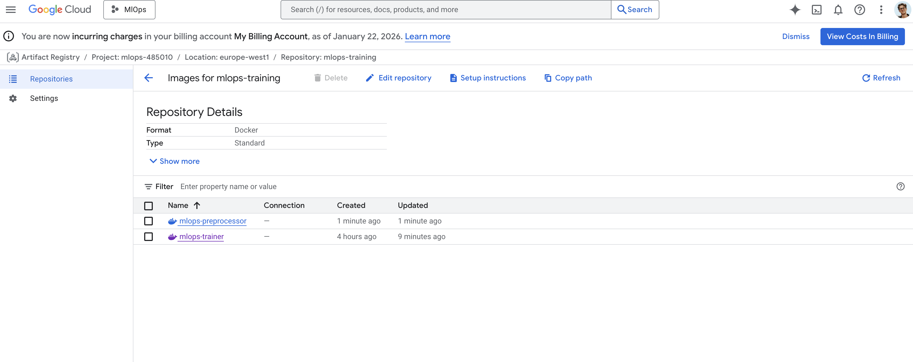
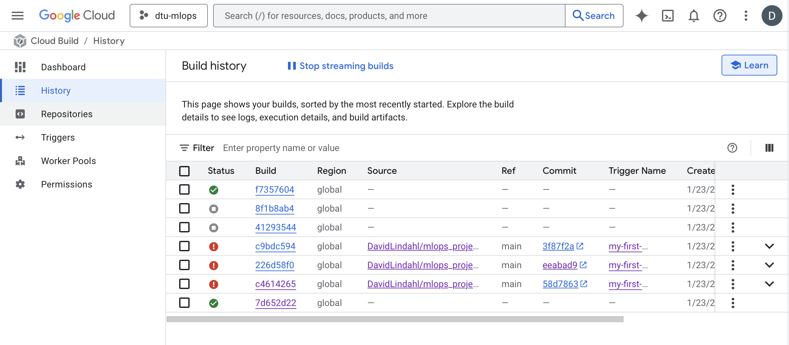
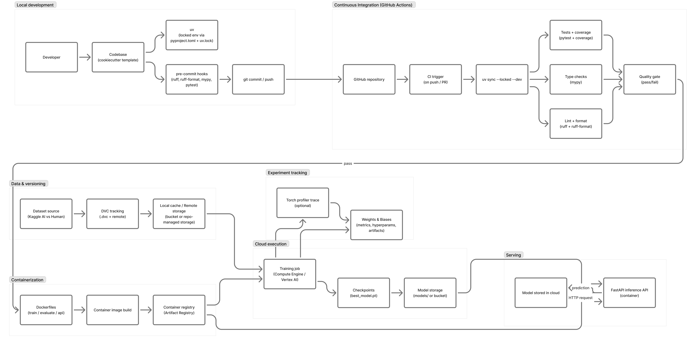

# Exam template for 02476 Machine Learning Operations

This is the report template for the exam. Please only remove the text formatted as with three dashes in front and behind
like:

```--- question 1 fill here ---```

Where you instead should add your answers. Any other changes may have unwanted consequences when your report is
auto-generated at the end of the course. For questions where you are asked to include images, start by adding the image
to the `figures` subfolder (please only use `.png`, `.jpg` or `.jpeg`) and then add the following code in your answer:

``

In addition to this markdown file, we also provide the `report.py` script that provides two utility functions:

Running:

```bash
python report.py html
```

Will generate a `.html` page of your report. After the deadline for answering this template, we will auto-scrape
everything in this `reports` folder and then use this utility to generate a `.html` page that will be your serve
as your final hand-in.

Running

```bash
python report.py check
```

Will check your answers in this template against the constraints listed for each question e.g. is your answer too
short, too long, or have you included an image when asked. For both functions to work you mustn't rename anything.
The script has two dependencies that can be installed with

```bash
pip install typer markdown
```

or

```bash
uv add typer markdown
```

## Overall project checklist

The checklist is *exhaustive* which means that it includes everything that you could do on the project included in the
curriculum in this course. Therefore, we do not expect at all that you have checked all boxes at the end of the project.
The parenthesis at the end indicates what module the bullet point is related to. Please be honest in your answers, we
will check the repositories and the code to verify your answers.

### Week 1

* [ ] Create a git repository (M5)
* [ ] Make sure that all team members have write access to the GitHub repository (M5)
* [ ] Create a dedicated environment for you project to keep track of your packages (M2)
* [ ] Create the initial file structure using cookiecutter with an appropriate template (M6)
* [ ] Fill out the `data.py` file such that it downloads whatever data you need and preprocesses it (if necessary) (M6)
* [ ] Add a model to `model.py` and a training procedure to `train.py` and get that running (M6)
* [ ] Remember to either fill out the `requirements.txt`/`requirements_dev.txt` files or keeping your
    `pyproject.toml`/`uv.lock` up-to-date with whatever dependencies that you are using (M2+M6)
* [ ] Remember to comply with good coding practices (`pep8`) while doing the project (M7)
* [ ] Do a bit of code typing and remember to document essential parts of your code (M7)
* [ ] Setup version control for your data or part of your data (M8)
* [ ] Add command line interfaces and project commands to your code where it makes sense (M9)
* [ ] Construct one or multiple docker files for your code (M10)
* [ ] Build the docker files locally and make sure they work as intended (M10)
* [ ] Write one or multiple configurations files for your experiments (M11)
* [ ] Used Hydra to load the configurations and manage your hyperparameters (M11)
* [ ] Use profiling to optimize your code (M12)
* [ ] Use logging to log important events in your code (M14)
* [ ] Use Weights & Biases to log training progress and other important metrics/artifacts in your code (M14)
* [ ] Consider running a hyperparameter optimization sweep (M14)
* [ ] Use PyTorch-lightning (if applicable) to reduce the amount of boilerplate in your code (M15)

### Week 2

* [ ] Write unit tests related to the data part of your code (M16)
* [ ] Write unit tests related to model construction and or model training (M16)
* [ ] Calculate the code coverage (M16)
* [ ] Get some continuous integration running on the GitHub repository (M17)
* [ ] Add caching and multi-os/python/pytorch testing to your continuous integration (M17)
* [ ] Add a linting step to your continuous integration (M17)
* [ ] Add pre-commit hooks to your version control setup (M18)
* [ ] Add a continues workflow that triggers when data changes (M19)
* [ ] Add a continues workflow that triggers when changes to the model registry is made (M19)
* [ ] Create a data storage in GCP Bucket for your data and link this with your data version control setup (M21)
* [ ] Create a trigger workflow for automatically building your docker images (M21)
* [ ] Get your model training in GCP using either the Engine or Vertex AI (M21)
* [ ] Create a FastAPI application that can do inference using your model (M22)
* [ ] Deploy your model in GCP using either Functions or Run as the backend (M23)
* [ ] Write API tests for your application and setup continues integration for these (M24)
* [ ] Load test your application (M24)
* [ ] Create a more specialized ML-deployment API using either ONNX or BentoML, or both (M25)
* [ ] Create a frontend for your API (M26)

### Week 3

* [ ] Check how robust your model is towards data drifting (M27)
* [ ] Setup collection of input-output data from your deployed application (M27)
* [ ] Deploy to the cloud a drift detection API (M27)
* [ ] Instrument your API with a couple of system metrics (M28)
* [ ] Setup cloud monitoring of your instrumented application (M28)
* [ ] Create one or more alert systems in GCP to alert you if your app is not behaving correctly (M28)
* [ ] If applicable, optimize the performance of your data loading using distributed data loading (M29)
* [ ] If applicable, optimize the performance of your training pipeline by using distributed training (M30)
* [ ] Play around with quantization, compilation and pruning for you trained models to increase inference speed (M31)

### Extra

* [ ] Write some documentation for your application (M32)
* [ ] Publish the documentation to GitHub Pages (M32)
* [ ] Revisit your initial project description. Did the project turn out as you wanted?
* [ ] Create an architectural diagram over your MLOps pipeline
* [ ] Make sure all group members have an understanding about all parts of the project
* [ ] Uploaded all your code to GitHub

## Group information

### Question 1
> **Enter the group number you signed up on <learn.inside.dtu.dk>**
>
> Answer:

79

### Question 2
> **Enter the study number for each member in the group**
>
> Example:
>
> *sXXXXXX, sXXXXXX, sXXXXXX*
>
> Answer:

s234818, s234817, s224177

### Question 3
> **Did you end up using any open-source frameworks/packages not covered in the course during your project? If so**
> **which did you use and how did they help you complete the project?**
>
> Recommended answer length: 0-200 words.
>
> Example:
> *We used the third-party framework ... in our project. We used functionality ... and functionality ... from the*
> *package to do ... and ... in our project*.
>
> Answer:

We used the timm library to load the model in our project. Other than that we used simple ML packages like pandas
and torch for dataloading, nothing out of the ordinary.

## Coding environment

> In the following section we are interested in learning more about you local development environment. This includes
> how you managed dependencies, the structure of your code and how you managed code quality.

### Question 4

> **Explain how you managed dependencies in your project? Explain the process a new team member would have to go**
> **through to get an exact copy of your environment.**
>
> Recommended answer length: 100-200 words
>
> Example:
> *We used ... for managing our dependencies. The list of dependencies was auto-generated using ... . To get a*
> *complete copy of our development environment, one would have to run the following commands*
>
> Answer:

We used uv for managing out dependencies. UV is the new SOTA that you introduced to us. To run files in the
project, one simply has the run uv sync first to get the dependecies. To run files (eg. train), we updated the
`tasks.py` file, so that you simply run in the terminal uv run train.

### Question 5

> **We expect that you initialized your project using the cookiecutter template. Explain the overall structure of your**
> **code. What did you fill out? Did you deviate from the template in some way?**
>
> Recommended answer length: 100-200 words
>
> Example:
> *From the cookiecutter template we have filled out the ... , ... and ... folder. We have removed the ... folder*
> *because we did not use any ... in our project. We have added an ... folder that contains ... for running our*
> *experiments.*
>
> Answer:

From the cookiecutter template we have filled out the src, configs, dockerfiles, data, docs, tests, and notebooks
folder. We added a .dvc folder, that contains the dvc cache (if data is cached), and config for dvc. It was
automatically generated, when we set up dvc.

### Question 6

> **Did you implement any rules for code quality and format? What about typing and documentation? Additionally,**
> **explain with your own words why these concepts matters in larger projects.**
>
> Recommended answer length: 100-200 words.
>
> Example:
> *We used ... for linting and ... for formatting. We also used ... for typing and ... for documentation. These*
> *concepts are important in larger projects because ... . For example, typing ...*
>
> Answer:

We implemented code quality rules using pre-commit hooks and enforced style and correctness with ruff. Ruff was
configured to run both linting (ruff check) and formatting (ruff format) so the codebase stays consistent and common
issues are caught early. We also added mypy for static type checking, and fixed several typing issues so that type
errors are detected before runtime. Documentation was handled through docstrings in key functions/classes and by
keeping configuration and scripts understandable for other team members. These practices matter more as projects grow
because they reduce friction in collaboration, but we found that in a project of this size it was probably a little
overkill.

## Version control

> In the following section we are interested in how version control was used in your project during development to
> corporate and increase the quality of your code.

### Question 7

> **How many tests did you implement and what are they testing in your code?**
>
> Recommended answer length: 50-100 words.
>
> Example:
> *In total we have implemented X tests. Primarily we are testing ... and ... as these the most critical parts of our*
> *application but also ... .*
>
> Answer:

We implemented a small test suite focused on CI-safe behavior. Tests cover the dataset loader using a temporary folder
with a generated image and train.csv, deterministic seeding, a smoke test that trains for one epoch on tiny synthetic
data, and an integration-style test that loads a saved model state and runs a forward pass. We avoided tests that
require downloading data or network access.

### Question 8

> **What is the total code coverage (in percentage) of your code? If your code had a code coverage of 100% (or close**
> **to), would you still trust it to be error free? Explain you reasoning.**
>
> Recommended answer length: 100-200 words.
>
> Example:
> *The total code coverage of code is X%, which includes all our source code. We are far from 100% coverage of our **
> *code and even if we were then...*
>
> Answer:

Our total code coverage is around 75–80%. Coverage is useful as a sanity check because it shows which parts of the
code are executed by tests and helps us find untested modules and branches. However, even 100% coverage would not
guarantee the code is error free, executing a line is not the same as validating correct behavior. Tests can miss
edge cases, make weak assertions, or fail to cover important branch conditions. Coverage is therefore a guide for
where to add tests, not a proof of correctness.

### Question 9

> **Did you workflow include using branches and pull requests? If yes, explain how. If not, explain how branches and**
> **pull request can help improve version control.**
>
> Recommended answer length: 100-200 words.
>
> Example:
> *We made use of both branches and PRs in our project. In our group, each member had an branch that they worked on in*
> *addition to the main branch. To merge code we ...*
>
> Answer:

From the start of the project, we alawys worked in branches, and merged into main when we were done with a feature. We
setup dependabot to automatically update the dependencies in the project, using pull requests. Using different
brannches ensured, that we could work on seperate features at the same time, and not interfere with each other.

### Question 10

> **Did you use DVC for managing data in your project? If yes, then how did it improve your project to have version**
> **control of your data. If no, explain a case where it would be beneficial to have version control of your data.**
>
> Recommended answer length: 100-200 words.
>
> Example:
> *We did make use of DVC in the following way: ... . In the end it helped us in ... for controlling ... part of our*
> *pipeline*
>
> Answer:

We started off using dvc. This was a good choice in the start, since we did not have to locally store 11gb of image
files, and could simply run 'dvc pull' to get the data. However, later in the process, when we wanted to train the
model using GCP, we realized that GCP has buckets, that are better when training using vertex AI.

### Question 11

> **Discuss you continuous integration setup. What kind of continuous integration are you running (unittesting,**
> **linting, etc.)? Do you test multiple operating systems, Python  version etc. Do you make use of caching? Feel free**
> **to insert a link to one of your GitHub actions workflow.**
>
> Recommended answer length: 200-300 words.
>
> Example:
> *We have organized our continuous integration into 3 separate files: one for doing ..., one for running ... testing*
> *and one for running ... . In particular for our ..., we used ... .An example of a triggered workflow can be seen*
> *here: <weblink>*
>
> Answer:

We ended up using hydra and having multiple config files for the project. Using hydra allowed us to change
hyperparameters 2 ways:
1. Either using CLI arguments, which is helpful when running a VM.
2. Changing arguments in the config files, which were nice when running things locally.

## Running code and tracking experiments

> In the following section we are interested in learning more about the experimental setup for running your code and
> especially the reproducibility of your experiments.

### Question 12

> **How did you configure experiments? Did you make use of config files? Explain with coding examples of how you would**
> **run a experiment.**
>
> Recommended answer length: 50-100 words.
>
> Example:
> *We used a simple argparser, that worked in the following way: Python  my_script.py --lr 1e-3 --batch_size 25*
>
> Answer:

We started out using a mix of typer, hydra and argparse. At one point we realized, that these packages offer
something very close to the same. We ended up using hydra and config files, which proved useful when wanting to save
hyperparameters, configurations etc. when training the model. To make our scripts the simplest and easiest for new
users to reproduce, the training script loads the config files for hyperparameters. If a user wants to try out a
different config, he can change them in the config file.

### Question 13

> **Reproducibility of experiments are important. Related to the last question, how did you secure that no information**
> **is lost when running experiments and that your experiments are reproducible?**
>
> Recommended answer length: 100-200 words.
>
> Example:
> *We made use of config files. Whenever an experiment is run the following happens: ... . To reproduce an experiment*
> *one would have to do ...*
>
> Answer:

To ensure, that our hyperparameters weren't lost, easy to find, we used config files and hydra to load the config
files. Furthermore we performed training and evaluation in a docker-container. This is done to ensure, that the model
can be reproduced exactly the same way, on everyones computer.

### Question 14

> **Upload 1 to 3 screenshots that show the experiments that you have done in W&B (or another experiment tracking**
> **service of your choice). This may include loss graphs, logged images, hyperparameter sweeps etc. You can take**
> **inspiration from [this figure](figures/wandb.png). Explain what metrics you are tracking and why they are**
> **important.**
>
> Recommended answer length: 200-300 words + 1 to 3 screenshots.
>
> Example:
> *As seen in the first image when have tracked ... and ... which both inform us about ... in our experiments.*
> *As seen in the second image we are also tracking ... and ...*
>
> Answer:

In  we see the train/loss, train/acc, val/loss and val/acc. When training
it is essential to track the performance. Specifically we look at the train/loss to see if the model is learning, and
if the loss is decreasing. Furthermore we track the train/acc. This is also necessary, since a wrong choice of
loss-function can lead to a model "learning", but not being useful.

If both train/loss and train/acc is getting better, one could make the mistake of thinking that it is a good model.
However, these metrics do not take overfitting into account, and how generelizable the predictions are. Therefore, we
have a validation-set, that we a constantly benchmarking against, to see if the model is overfitting or not.


We also looked at the gpu utilization and how much of that time was spent accessing memory, most of the time our GPU
usage is around 100% which is good, but much of that time is also spent accessing memory, which might mean there is
room for optimization.

### Question 15

> **Docker is an important tool for creating containerized applications. Explain how you used docker in your**
> **experiments/project? Include how you would run your docker images and include a link to one of your docker files.**
>
> Recommended answer length: 100-200 words.
>
> Example:
> *For our project we developed several images: one for training, inference and deployment. For example to run the*
> *training docker image: `docker run trainer:latest lr=1e-3 batch_size=64`. Link to docker file: <weblink>*
>
> Answer:

We used Docker when we preprocessed data and trained the model (defined in our `dockerfiles`). We used Docker as a
tool to make the training work on all machines, making the project more reproducible. We used GCP's Artifact Registry
to store Docker images and used Vertex AI to train the model on a T4 GPU.

To run the training via Docker, first build the image with:
`docker build -f dockerfiles/vertex_train.dockerfile . -t train:latest`

Then run the image with:
`docker run train:latest`

This will run the training with our predetermined hyperparameters. To change hyperparameters, e.g., the learning
rate, you can modify the configuration in `configs/train.yaml`.

### Question 16

> **When running into bugs while trying to run your experiments, how did you perform debugging? Additionally, did you**
> **try to profile your code or do you think it is already perfect?**
>
> Recommended answer length: 100-200 words.
>
> Example:
> *Debugging method was dependent on group member. Some just used ... and others used ... . We did a single profiling*
> *run of our main code at some point that showed ...*
>
> Answer:

We used alot of generative ai chat bots to help with debugging, otherwise we looked at the WandB plots to help see
what was happening with our experiments and if they were running correctly. We did try using profiling, but did not
make any major discoveries other then alot of time is spent

## Working in the cloud

> In the following section we would like to know more about your experience when developing in the cloud.

### Question 17

> **List all the GCP services that you made use of in your project and shortly explain what each service does?**
>
> Recommended answer length: 50-200 words.
>
> Example:
> *We used the following two services: Engine and Bucket. Engine is used for... and Bucket is used for...*
>
> Answer:

Firstly we used GCP's bucket. We uploaded the raw data to the bucket. We locally preprocessed the data, and modified
the bucket. We then used Vertex AI to train the model. Looking back, it would be possilbe to preprocces data faster
using one of the VM's that google's compute engine service provides. However due to it not being to costly to
preprocces data locally, (And the VM's we had acces to were on par with our own PC's), we decided to do it that way.

### Question 18

> **The backbone of GCP is the Compute engine. Explained how you made use of this service and what type of VMs**
> **you used?**
>
> Recommended answer length: 100-200 words.
>
> Example:
> *We used the compute engine to run our ... . We used instances with the following hardware: ... and we started the*
> *using a custom container: ...*
>
> Answer:

We played around with the compute engine, for some smaller tasks. However, for the big training of the model, we used
Vertex AI, that indirectly via a docker image and .yaml-file creates a VM, that performs the training.

### Question 19

> **Insert 1-2 images of your GCP bucket, such that we can see what data you have stored in it.**
> **You can take inspiration from [this figure](figures/bucket.png).**
>
> Answer:



### Question 20

> **Upload 1-2 images of your GCP artifact registry, such that we can see the different docker images that you have**
> **stored. You can take inspiration from [this figure](figures/registry.png).**
>
> Answer:



### Question 21

> **Upload 1-2 images of your GCP cloud build history, so we can see the history of the images that have been build in**
> **your project. You can take inspiration from [this figure](figures/build.png).**
>
> Answer:



### Question 22

> **Did you manage to train your model in the cloud using either the Engine or Vertex AI? If yes, explain how you did**
> **it. If not, describe why.**
>
> Recommended answer length: 100-200 words.
>
> Example:
> *We managed to train our model in the cloud using the Engine. We did this by ... . The reason we choose the Engine*
> *was because ...*
>
> Answer:

We managed to train our model using vertex AI. While on paper, this is the best way, and it has been a good learning
experience, we did find both ups and downs. The CLI was very user friendly, and once we had dockerfiles, it was
fairly easy to start training. The mounting of buckets to vertex AI meant, that we could train with 0 data on our
local PC's, which was a huge upside. Downsides:
- New image every time you change the code (we tried automating this, but it still takes time to make this image)
- You need a vertex dockerfile, vertex .yaml file, which is more complexity. More files in the repo means more
complexity for new users to understand
- Stream logs to terminal doesn't work. This costed us hours of labour, to bugfix why the VM didn't show us that it was
training
- The VM's where not significantly better than our own PC's
We used an NVIDIA T4 GPU on the VM N1-standard-8.

## Deployment

### Question 23

> **Did you manage to write an API for your model? If yes, explain how you did it and if you did anything special. If**
> **not, explain how you would do it.**
>
> Recommended answer length: 100-200 words.
>
> Example:
> *We did manage to write an API for our model. We used FastAPI to do this. We did this by ... . We also added ...*
> *to the API to make it more ...*
>
> Answer:

We did not put too much time into creating a global API access, and make frontend. We setup a local API, that can be
accessed via FastAPI, that if more time is put into, one can design frontend and host the API online, for global
interaction with our model.

### Question 24

> **Did you manage to deploy your API, either in locally or cloud? If not, describe why. If yes, describe how and**
> **preferably how you invoke your deployed service?**
>
> Recommended answer length: 100-200 words.
>
> Example:
> *For deployment we wrapped our model into application using ... . We first tried locally serving the model, which*
> *worked. Afterwards we deployed it in the cloud, using ... . To invoke the service an user would call*
> *`curl -X POST -F "file=@file.json"<weburl>`*
>
> Answer:

We setup API locally. If we wanted to deploy it in the cloud, the process would be seamless since we have already
containerized the application. We would build the API Docker image defined in `dockerfiles/api.dockerfile`, push it to
the Google Artifact Registry, and deploy it as a serverless service on Cloud Run. This would provide a HTTPS URL to
send inference requests to, functioning identically to our local setup.

### Question 25

> **Did you perform any unit testing and load testing of your API? If yes, explain how you did it and what results for**
> **the load testing did you get. If not, explain how you would do it.**
>
> Recommended answer length: 100-200 words.
>
> Example:
> *For unit testing we used ... and for load testing we used ... . The results of the load testing showed that ...*
> *before the service crashed.*
>
> Answer:

We did not. If we were to do so, we could make a test of the output (is it binary?), does the server respond, can we
upload a photo etc.

### Question 26

> **Did you manage to implement monitoring of your deployed model? If yes, explain how it works. If not, explain how**
> **monitoring would help the longevity of your application.**
>
> Recommended answer length: 100-200 words.
>
> Example:
> *We did not manage to implement monitoring. We would like to have monitoring implemented such that over time we could*
> *measure ... and ... that would inform us about this ... behaviour of our application.*
>
> Answer:

We did not implement monitoring for a deployed inference service. Monitoring would be important for this project
because the data distribution is likely to change over time: new generative models and editing tools can produce
images with different artifacts than the ones in our training set. In practice, we would monitor both model
performance signals and data drift signals. On the performance side, we would track predicted class confidence, class
balance over time, latency, and error rates, and—when labels are available—accuracy/precision-recall on a rolling
window. On the data side, we would run drift tests comparing recent inputs against the training distribution. Alerts
could trigger when drift exceeds a threshold or when confidence collapses, indicating the model is no longer
reliable. This would help decide when to retrain, what new data to collect, and whether to roll back or update the
deployed model.

## Overall discussion of project

> In the following section we would like you to think about the general structure of your project.

### Question 27

> **How many credits did you end up using during the project and what service was most expensive? In general what do**
> **you think about working in the cloud?**
>
> Recommended answer length: 100-200 words.
>
> Example:
> *Group member 1 used ..., Group member 2 used ..., in total ... credits was spend during development. The service*
> *costing the most was ... due to ... . Working in the cloud was ...*
>
> Answer:

Group member 1: David used $1.55. Storage was the most expensive. Group member 2, Oscar, used $1.13. It seemed quite
practical to be able to develop locally while running and testing code in the cloud. Then we could have several
models testing at the same time - even when our laptops were turned off. And as long as everything ran inside Docker,
we knew that it would be reproducible. However, it did take a bit of the development time away from iterating, when we
had to juggle the cloud and docker as well.

### Question 28

> **Did you implement anything extra in your project that is not covered by other questions? Maybe you implemented**
> **a frontend for your API, use extra version control features, a drift detection service, a kubernetes cluster etc.**
> **If yes, explain what you did and why.**
>
> Recommended answer length: 0-200 words.
>
> Example:
> *We implemented a frontend for our API. We did this because we wanted to show the user ... . The frontend was*
> *implemented using ...*
>
> Answer:

We did not.

### Question 29

> **Include a figure that describes the overall architecture of your system and what services that you make use of.**
> **You can take inspiration from [this figure](figures/overview.png). Additionally, in your own words, explain the**
> **overall steps in figure.**
>
> Recommended answer length: 200-400 words
>
> Example:
> *The starting point of the diagram is our local setup, where we integrated ... and ... and ... into our code.*
> *Whenever we commit code and push to GitHub, it auto triggers ... and ... . From there the diagram shows ...*
>
> Answer:



### Question 30

> **Discuss the overall struggles of the project. Where did you spend most time and what did you do to overcome these**
> **challenges?**
>
> Recommended answer length: 200-400 words.
>
> Example:
> *The biggest challenges in the project was using ... tool to do ... . The reason for this was ...*
>
> Answer:

the biggest challenge was by far getting the model to train correclty in the cloud. We ran into issues with getting
access to GPUs, getting the data uploaded to the cloud, loading data from the correct bucket and making sure the model
was training correctly. some of these issues were solved by connecting to WandB and getting some more in depth feedback
then was avalable in the terminal. Otherwise just keep trying for hours was useally what made it work. we also ran in
to more practical problems with git, not commiting the data, pushing the correct , merging correctly and setting up
pre-commit.

### Question 31

> **State the individual contributions of each team member. This is required information from DTU, because we need to**
> **make sure all members contributed actively to the project. Additionally, state if/how you have used generative AI**
> **tools in your project.**
>
> Recommended answer length: 50-300 words.
>
> Example:
> *Student sXXXXXX was in charge of developing of setting up the initial cookie cutter project and developing of the*
> *docker containers for training our applications.*
> *Student sXXXXXX was in charge of training our models in the cloud and deploying them afterwards.*
> *All members contributed to code by...*
> *We have used ChatGPT to help debug our code. Additionally, we used GitHub Copilot to help write some of our code.*
>
> Answer:

**Individual contribution (Nikolaj, s234818):** Nikolaj mainly worked on cleaning up Git issues (ignoring/removing large
data from commits), stabilizing the repo structure, and setting up code quality automation with pre-commit (Ruff
lint/format, mypy). He implemented and expanded the test suite (unit tests plus smoke/integration tests) and added
coverage reporting in CI. He also integrated Weights and Biases logging into training, including hyperparameter
logging, artifacts for the best checkpoint, and optional torch profiler traces for performance inspection.

**Individual contribution (David, s234817):** I set up the initial project structure using Cookiecutter, configured
Dependabot for automated dependency updates, implemented initial tests, and assisted with Docker integration for
reproducible environments. Generative AI tools (e.g., ChatGPT/Copilot) were used sparingly for suggestions and
troubleshooting, with all outputs reviewed and adapted manually.

**Individual contribution (Oscar, s224177):** Implemented the model, training, and inference. Responsible for creating
the GCP framework with Docker and Vertex AI, and local API inference with FastAPI.

All group members were included in every part of the development process. We have used ChatGPT, Claude, and Cursor to
help debug and write some of our code.
